# 冒泡排序（Bubble sort）

**时间复杂度：**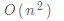

**空间复杂度**：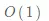

**排序思想**：对相邻的元素进行两两比较，顺序相反则进行交换，这样，每一趟会将最小或最大的元素“浮”到顶端，最终达到完全有序。

**原理图解**：

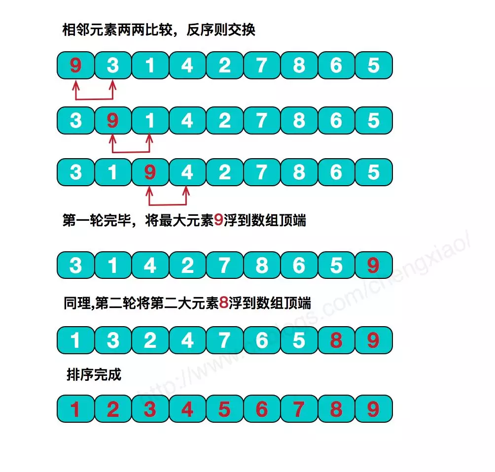

**代码实现**：

```python
def bubble_sort(array, reverse=False):
    length = len(array)
    # 循环length次，每一次都选出一个最大/小值，浮到最后。
    for i in range(length):
        end = length-i
        for k in range(end):
            # 正序
            if not reverse:
                if k+1 < end and array[k] > array[k+1]:
                    array[k+1],array[k] = array[k],array[k+1]
            # 倒序
            else:
                if k+1 < end and array[k] < array[k+1]:
                    array[k+1],array[k] = array[k],array[k+1]
    return array

```


# 插入排序（Insertion sort）

**时间复杂度**：$O(n^2)$
**空间复杂度**：$O(1)$

**排序思想**：每次将一个待排序的元素与已排序的元素进行逐一比较，直到找到合适的位置按大小插入。通俗地说，就类似我们打牌的时候，给牌进行排序。

**原理图解**：

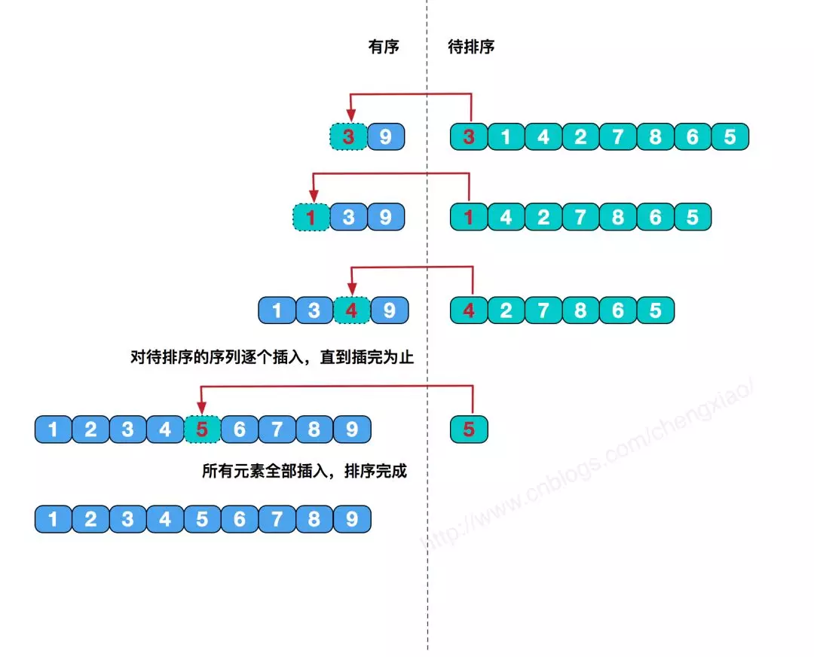

代码实现**：

```python
def insert_sort(array,reverse=False):
    length = len(array)
    for index in range(1,length):
        # 当前要比较的值
        current_value = array[index]
        position = index
        # 正序
        if not reverse:
            while position>0 and array[position-1]>current_value:
                array[position] = array[position-1]
                position -= 1
            array[position] = current_value
        # 倒序
        else:
            while position>0 and array[position-1]<current_value:
                array[position] = array[position-1]
                position -= 1
            array[position] = current_value
    return array
```


# 希尔排序

*希尔排序是插入排序的一种优化算法*

**时间复杂度**：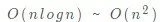
**空间复杂度**：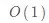

**排序思想**： 希尔排序，有时也叫做“最小增量排序”，该算法是冲破的第一批算法之一。通过把原始的序列以增量(网上通常叫做 gap，意为间隔，在下面代码中我把它体现为分组数，group_num。)进行分组，分解成几个子序列来提高效率，其中每个小序列使用的都是插入排序，使得该组有序。

**原理图解**：

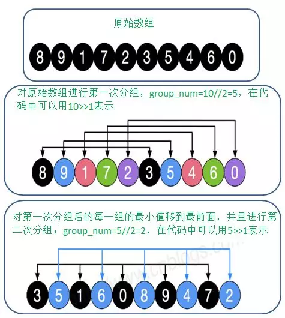


代码实现：

```python
def shell_sort(array, reverse=False):
    length = len(array)
    # 长度的一半，>> 是位运算，相当于是"length//2"
    group_num = length >> 1
    while group_num > 0:
        for i in range(group_num, length):
            current_index_value = array[i]
            # k的作用：用于当前索引往前移动n个group_num的索引
            k = i
            # while循环把同一组的最小值移到最前
            # 正序
            if not reverse:
                while k >= group_num and array[k-group_num] > current_index_value:
                    array[k] = array[k-group_num]
                    # 索引往前移动
                    k -= group_num
            # 倒序
            else:
                while k >= group_num and array[k-group_num] < current_index_value:
                    array[k] = array[k-group_num]
                    # 索引往前移动
                    k -= group_num
            array[k] = current_index_value

        group_num >>= 1
    return array
```


# 选择排序（Selection sort）

**时间复杂度**：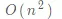
**空间复杂度**：

**排序思想**：遍历n趟（n为数组的长度），每一趟都从「待排序」的元素中排出最小（或最大）的元素。

**原理图解**：

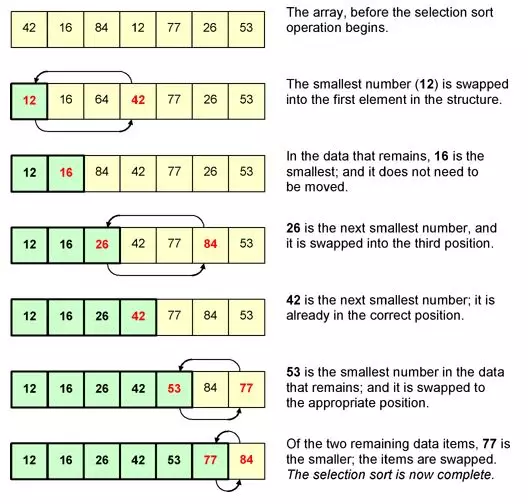

**代码实现**：

```python
def select_sort(array, reverse=False):
    length = len(array)
    for x in range(length):
        # 每次循环里，最大或者最小值的索引：边缘索引
        edge_index = 0
        for y in range(length-x):
            # 正序
            if not reverse:
                if array[y] > array[edge_index]:
                    edge_index = y
            # 倒序
            else:
                if array[y] < array[edge_index]:
                    edge_index = y
        array[length-x-1],array[edge_index] = array[edge_index],array[length-x-1]
    return array
```


# 为什么插入排序比冒泡排序更受欢迎？


从代码实现上来看，冒泡排序的数据交换要比插入排序的数据移动要复杂，冒泡排序需要 3 个赋值操作，而插入排序只需要 1 个。我们来看这段操作：

```c++
//冒泡排序中数据的交换操作：
if (a[j] > a[j+1]) { // 交换
  int tmp = a[j];
  a[j] = a[j+1];
  a[j+1] = tmp;
  flag = true;
}

//插入排序中数据的移动操作：
if (a[j] > value) {
  a[j+1] = a[j];  // 数据移动
} else {
  break;
}

```

---

# 快速排序（Quick sort）

**时间复杂度**：$O(nlog(n))$
**空间复杂度**：$O(logn) $ ~ $O(n)$

**排序思想**：选取一个数组中的某个数，将整个数组分为两个子数组（小于此数的为一组，大于此数的为一组）。然后对分出的子数组，重复以上步骤。

**原理图解**：

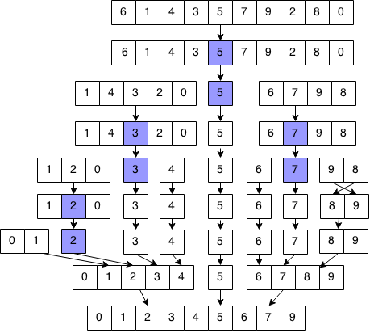

**代码实现**：

```python
def quick_sort(array, reverse=False):
    if len(array) > 0:
        pivot = array[0]
        # 这里使用列表生成式，是为了代码可读性。
        # 这里其实应该使用的是for循环，不然每递归一次就多循环了一次。
        less = [x for x in array if x < pivot]
        greater = [x for x in array if x > pivot]
        # 正序
        if not reverse:
            return  quick_sort(less, reverse) + [pivot] + quick_sort(greater, reverse)
        # 倒序
        else:
            return quick_sort(greater, reverse) + [pivot] + quick_sort(less, reverse)
    return []
```


如果我们希望快排是原地排序算法，那 partition()分区函数就不能占据太多额外的内存空间，我们就需要在$A[p...r]$ 的原地完成分区操作。其实现思路非常巧妙，我写成了伪代码。

```
partition(A, p, r) {
  pivot := A[r]
  i := p
  for j := p to r-1 do {
    if A[j] < pivot {
      swap A[i] with A[j]
      i := i+1
    }
  }
  swap A[i] with A[r]
  return i

```


# 归并排序（Merge sort）

**时间复杂度**：$O(nlogn)$
**空间复杂度**：$O(n)$

**排序思想**：归并排序，是利用归并的思想实现的排序方法，该算法采用经典的分治（divide-and-conquer）策略（分治法将问题分(divide)成一些小的问题然后递归求解，而治(conquer)的阶段则将分的阶段得到的各答案"修补"在一起，即分而治之)。

第一次接触到这个分治思想，是在《算法图解》这本书里，里面举的一个「分割土地」的例子非常生动形象。精髓就是，不断将问题的规模缩小化，然后逐步往上解决问题。

**原理图解**：

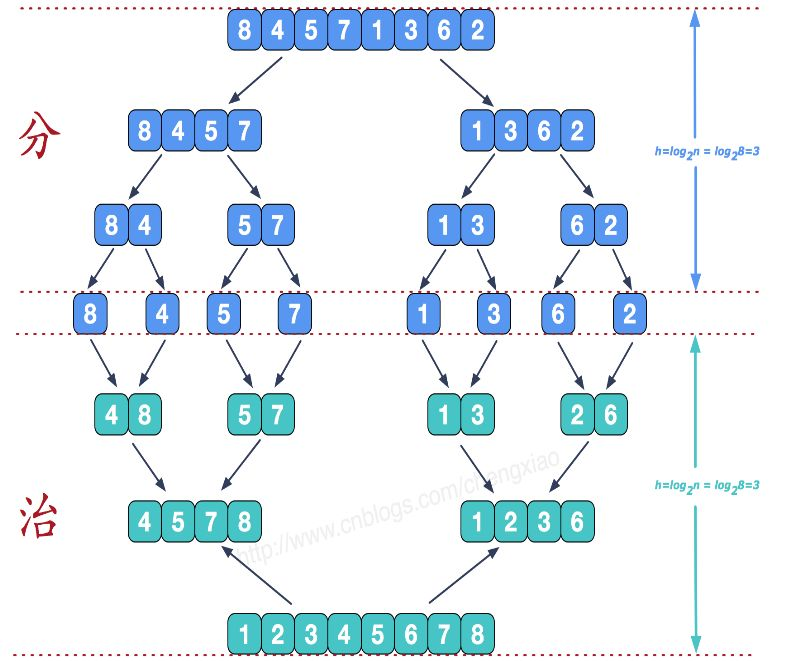

重点其实是这个“治”的过程，如何实现将两个有序数组合并起来？思路大概是这样的。

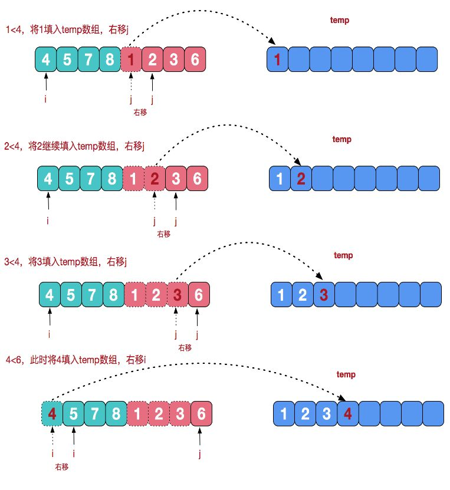

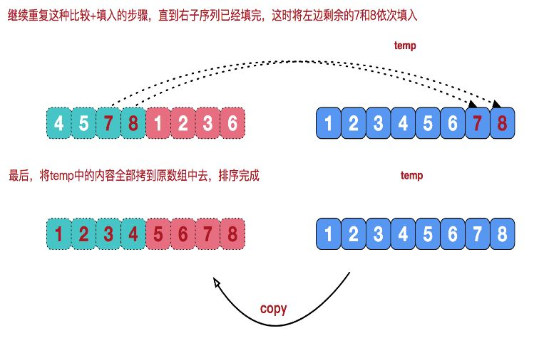

**代码实现**：

```python
# 分：分割最小化数组
def merge_sort(seq):
    if len(seq) <= 1:
        return seq
    mid = int(len(seq) / 2)
    left = merge_sort(seq[:mid])
    right = merge_sort(seq[mid:])
    return merge(left, right)

# 治：合并两有序数组
def merge(left, right):
    result = []
    i, j = 0, 0
    while i < len(left) and j < len(right):
        if left[i] <= right[j]:
            result.append(left[i])
            i += 1
        else:
            result.append(right[j])
            j += 1
    result += left[i:]
    result += right[j:]
    return result
```


---

# 桶排序（Bucket sort）

**时间复杂度:**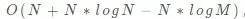

**空间复杂度:**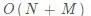

**排序思想**：桶排序（或所谓的箱排序），是一个排序算法，工作的原理是将数组分到有限数量的桶里。下面的代码我以每个数为一个桶，比较直观。可是你要知道当数组范围比较大时，可以以一个范围为一个桶，在桶内可以使用别的排序算法或者以递归方式继续使用桶排序进行排序。当要被排序的数组内的数值是均匀分配的时候，桶排序使用线性时间。

桶排序是有局限性的，一般情况下，他并不能对有负数或者有小数的数组进行排序。另一方面，在无法预知数组的真实情况下，其实排序性能是非常不稳定的。比如，你可能遇到这样一个数组[1,4,5,1000000]，按照桶算法以下面的代码运行，你需要1000000个桶，非常慢，而实际上，这个数组很小，使用任意比较排序算法很快就能结果。

**原理图解**：

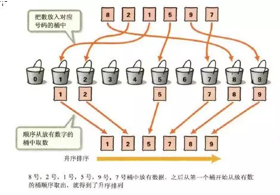

**代码实现**:

```python
def bucket_sort(array, reverse=False):
    _max = max(array)
    _min = min(array)
    # 桶的个数
    buckets = [0] * (_max - _min + 1)
    # 在桶里记录每个数出现的频率
    for i in array:
        buckets[i-_min] += 1

    sorted_list = []
    for index, item in enumerate(buckets):
        if item != 0:
            # 重复的数值要存储多次
            for x in range(item):
                sorted_list.append(index+_min)
    # 正序
    if not reverse:
        return sorted_list
    # 倒序
    else:
        return sorted_list[::-1]
```


# 计数排序（Counting sort）

**计数排序其实是桶排序的一种特殊情况**


```c++
// 计数排序，a 是数组，n 是数组大小。假设数组中存储的都是非负整数。
public void countingSort(int[] a, int n) {
  if (n <= 1) return;

  // 查找数组中数据的范围
  int max = a[0];
  for (int i = 1; i < n; ++i) {
    if (max < a[i]) {
      max = a[i];
    }
  }

  int[] c = new int[max + 1]; // 申请一个计数数组 c，下标大小 [0,max]
  for (int i = 0; i <= max; ++i) {
    c[i] = 0;
  }

  // 计算每个元素的个数，放入 c 中
  for (int i = 0; i < n; ++i) {
    c[a[i]]++;
  }

  // 依次累加
  for (int i = 1; i <= max; ++i) {
    c[i] = c[i-1] + c[i];
  }

  // 临时数组 r，存储排序之后的结果
  int[] r = new int[n];
  // 计算排序的关键步骤，有点难理解
  for (int i = n - 1; i >= 0; --i) {
    int index = c[a[i]]-1;
    r[index] = a[i];
    c[a[i]]--;
  }

  // 将结果拷贝给 a 数组
  for (int i = 0; i < n; ++i) {
    a[i] = r[i];
  }
}

```


# 基数排序（Radix sort）

**时间复杂度**：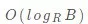

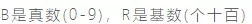

**空间复杂度**：


**排序思想**：是一种非比较型整数排序算法。其排序原理是，将所有待比较数值（正整数）统一为同样的数位长度，数位较短的数前面补零。然后，从最低位（个位）开始，依次进行一次排序。这样从最低位排序一直到最高位排序完成以后, 数列就变成一个有序序列。

基数排序法会使用到桶 (Bucket)，顾名思义，通过将要比较的位（个位、十位、百位…），将要排序的元素分配至 0~9 个桶中，借以达到排序的作用，在某些时候，基数排序法的效率高于其它的比较性排序法。

基数排序的方式可以采用 LSD (Least sgnificant digital) 或 MSD (Most sgnificant digital)，LSD 的排序方式由键值的最右边开始，而 MSD 则相反，由键值的最左边开始。

根据每位上的数值进行排序时，都会有以下两步：

- 分配。首先要将待排序序列中的当前位上的数字找到对应的桶；
- 收集。分配后需要对桶中的记录再串起来，形成一个新的排序序列，供下一次分配用。
  直至遍历完成，得到排序好的序列。

如何实现正序和倒序？
顺序的区别，其实就是你收集的时候，也就是将桶的元素串起来的时候，如果你是先从小号桶串起，那就是正序，如果你是从大号桶串起，那就是倒序。

**原理图解**：

这里图解下，正序的过程。
原始数组：22, 33, 43, 55, 14, 28, 65, 39, 81, 33, 100

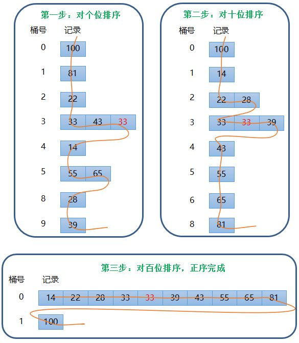

**代码实现**:

```python
def radix_sort(array, reverse=False):
    # 最大的数有几位，决定了要几轮排序
    d = len(str(max(array)))
    for k in range(d):
        # 因为每一位数字都是0~9，故建立10个桶
        buckets=[[] for i in range(10)]
        for i in array:
            # 举例：132//10=13，13%10=3
            buckets[i//(10**k)%10].append(i)
        array=[item for items in buckets for item in items]

    if not reverse:
        return array
    return array[::-1]
```


# 堆排序

- 堆是一个完全二叉树
- 堆中每一个节点的值都必须大于等于（或小于等于）其子树中每个节点的值（大顶堆、小顶堆）


**时间复杂度**：
**空间复杂度**：

要掌握堆排序，有一些预备知识，你需要了解，你必须得知道，什么是堆（二叉堆），什么是最大堆，什么是最小堆？

我在网上找了一篇很好教程，有需要可以前往查阅：*http://blog.51cto.com/jx610/1702260*

**排序思想**：堆排序，如果是正序，就把最大堆堆顶的最大数取出，将剩余的堆继续调整为最大堆，再次将堆顶的最大数取出，这个过程持续到剩余数只有一个时结束。如果是倒序，就把最小堆堆顶的最小数取出，将剩余的堆继续调整为最小堆，再次将堆顶的最小数取出，这个过程持续到剩余数只有一个时结束。

其实难点，在于如何在剩余堆里，找到最大数（或者最小数）。

**原理图解**：

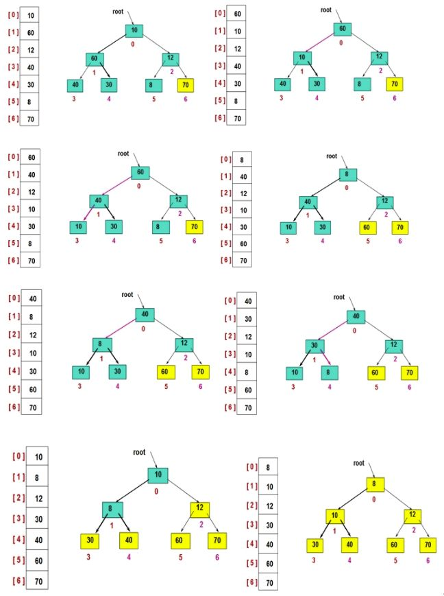

**代码实现**：

由于这里代码较多，为了不增加理解难度，先只实现了正序。

```python
# 建立最大堆
def build_max_heap(arr, start, end):
    root = start
    while True:
        # 从root开始对最大堆调整
        child = 2 * root + 1
        # 避免和已排过的数再比较
        if child > end:
            break

        # 找出两个child中较大的一个
        if child + 1 <= end and arr[child] < arr[child + 1]:
            child += 1

        if arr[root] < arr[child]:
            # 最大堆小于较大的child, 交换顺序
            arr[root], arr[child] = arr[child], arr[root]

            # 正在调整的节点设置为root
            root = child
        else:
            # 无需调整的时候, 退出
            break


def heap_sort(arr):
    # 从最后一个有子节点的节点开始，调整最大堆
    first = len(arr) // 2 - 1
    for start in range(first, -1, -1):
        build_max_heap(arr, start, len(arr) - 1)

    # 将最大的放到堆的最后一个, 堆-1, 继续调整排序
    for end in range(len(arr) -1, 0, -1):
        arr[0], arr[end] = arr[end], arr[0]
        build_max_heap(arr, 0, end - 1)
    return arr
```

同理，倒序也是一样，只要实现建立小堆函数即可。

```python
def build_min_heap(arr, start, end):
    root = start
    while True:
        # 从root开始对最小堆调整
        child = 2 * root + 1
        # 避免和已排过的数再比较
        if child > end:
            break

        # 找出两个child中较小的一个
        if child + 1 <= end and arr[child] > arr[child + 1]:
            child += 1

        if arr[root] > arr[child]:
            # 最大堆小于较小的child, 交换顺序
            arr[root], arr[child] = arr[child], arr[root]

            # 正在调整的节点设置为root
            root = child
        else:
            # 无需调整的时候, 退出
            break
```


```java
private static void buildHeap(int[] a, int n) {
  for (int i = n/2; i >= 1; --i) {
    heapify(a, n, i);
  }
}

private static void heapify(int[] a, int n, int i) {
  while (true) {
    int maxPos = i;
    if (i*2 <= n && a[i] < a[i*2]) maxPos = i*2;
    if (i*2+1 <= n && a[maxPos] < a[i*2+1]) maxPos = i*2+1;
    if (maxPos == i) break;
    swap(a, i, maxPos);
    i = maxPos;
  }
}

```


```java
// n 表示数据的个数，数组 a 中的数据从下标 1 到 n 的位置。
public static void sort(int[] a, int n) {
  buildHeap(a, n);
  int k = n;
  while (k > 1) {
    swap(a, 1, k);
    --k;
    heapify(a, k, 1);
  }
}

```


---

# 小结

