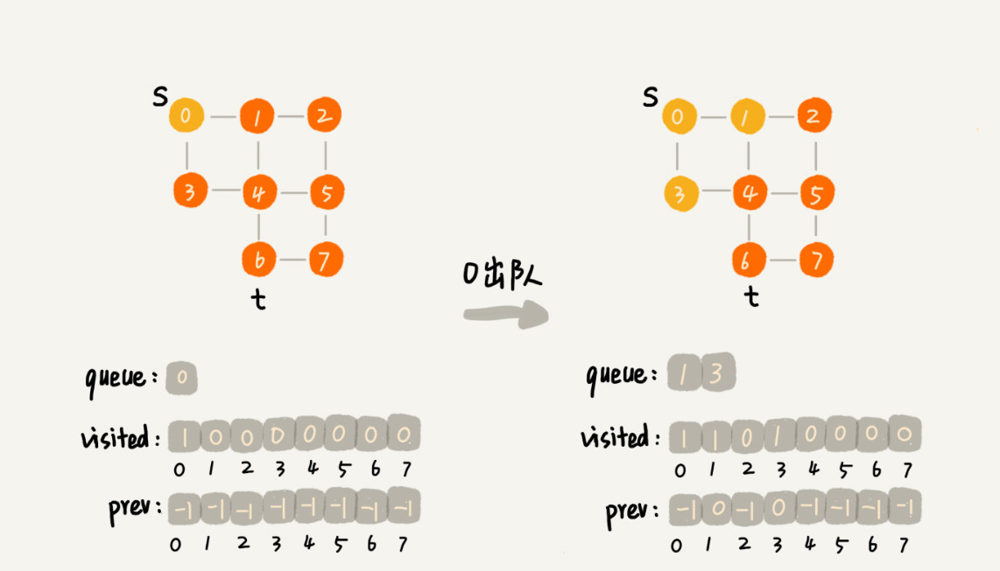

# 广度优先搜索（BFS）


```java
public void bfs(int s, int t) {
  if (s == t) return;
  boolean[] visited = new boolean[v];
  visited[s]=true;
  Queue<Integer> queue = new LinkedList<>();
  queue.add(s);
  int[] prev = new int[v];
  for (int i = 0; i < v; ++i) {
    prev[i] = -1;
  }
  while (queue.size() != 0) {
    int w = queue.poll();
   for (int i = 0; i < adj[w].size(); ++i) {
      int q = adj[w].get(i);
      if (!visited[q]) {
        prev[q] = w;
        if (q == t) {
          print(prev, s, t);
          return;
        }
        visited[q] = true;
        queue.add(q);
      }
    }
  }
}

private void print(int[] prev, int s, int t) { // 递归打印 s->t 的路径
  if (prev[t] != -1 && t != s) {
    print(prev, s, prev[t]);
  }
  System.out.print(t + " ");
}

```




---

# 深度优先搜索（DFS）（回溯算法）


```java
boolean found = false; // 全局变量或者类成员变量

public void dfs(int s, int t) {
  found = false;
  boolean[] visited = new boolean[v];
  int[] prev = new int[v];
  for (int i = 0; i < v; ++i) {
    prev[i] = -1;
  }
  recurDfs(s, t, visited, prev);
  print(prev, s, t);
}

private void recurDfs(int w, int t, boolean[] visited, int[] prev) {
  if (found == true) return;
  visited[w] = true;
  if (w == t) {
    found = true;
    return;
  }
  for (int i = 0; i < adj[w].size(); ++i) {
    int q = adj[w].get(i);
    if (!visited[q]) {
      prev[q] = w;
      recurDfs(q, t, visited, prev);
    }
  }
}

```

---

# bfs 和 dfs 的 Python 实现

```python
"""
    Breadth-first search and depth-first search.
    Author: Wenru Dong
"""

from typing import List, Optional, Generator, IO
from collections import deque

class Graph:
    """Undirected graph."""
    def __init__(self, num_vertices: int):
        self._num_vertices = num_vertices
        self._adjacency = [[] for _ in range(num_vertices)]

    def add_edge(self, s: int, t: int) -> None:
        self._adjacency[s].append(t)
        self._adjacency[t].append(s)

    def _generate_path(self, s: int, t: int, prev: List[Optional[int]]) -> Generator[str, None, None]:
        if prev[t] or s != t:
            yield from self._generate_path(s, prev[t], prev)
        yield str(t)

    def bfs(self, s: int, t: int) -> IO[str]:
        """Print out the path from Vertex s to Vertex t
        using bfs.
        """
        if s == t: return

        visited = [False] * self._num_vertices
        visited[s] = True
        q = deque()
        q.append(s)
        prev = [None] * self._num_vertices

        while q:
            v = q.popleft()
            for neighbour in self._adjacency[v]:
                if not visited[neighbour]:
                    prev[neighbour] = v
                    if neighbour == t:
                        print("->".join(self._generate_path(s, t, prev)))
                        return
                    visited[neighbour] = True
                    q.append(neighbour)

    def dfs(self, s: int, t: int) -> IO[str]:
        """Print out a path from Vertex s to Vertex t
        using dfs.
        """
        found = False
        visited = [False] * self._num_vertices
        prev = [None] * self._num_vertices

        def _dfs(from_vertex: int) -> None:
            nonlocal found
            if found: return
            visited[from_vertex] = True
            if from_vertex == t:
                found = True
                return
            for neighbour in self._adjacency[from_vertex]:
                if not visited[neighbour]:
                    prev[neighbour] = from_vertex
                    _dfs(neighbour)
        
        _dfs(s)
        print("->".join(self._generate_path(s, t, prev)))


if __name__ == "__main__":
    
    graph = Graph(8)

    graph.add_edge(0, 1)
    graph.add_edge(0, 3)
    graph.add_edge(1, 2)
    graph.add_edge(1, 4)
    graph.add_edge(2, 5)
    graph.add_edge(3, 4)
    graph.add_edge(4, 5)
    graph.add_edge(4, 6)
    graph.add_edge(5, 7)
    graph.add_edge(6, 7)

    graph.bfs(0, 7)
    graph.dfs(0, 7)
```

