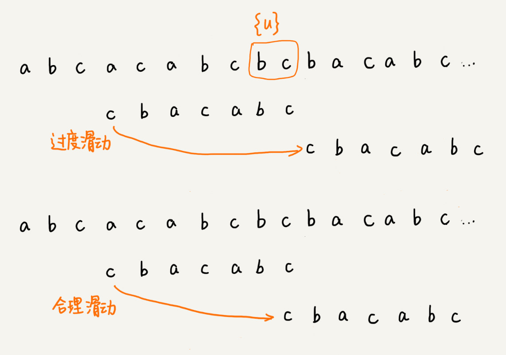
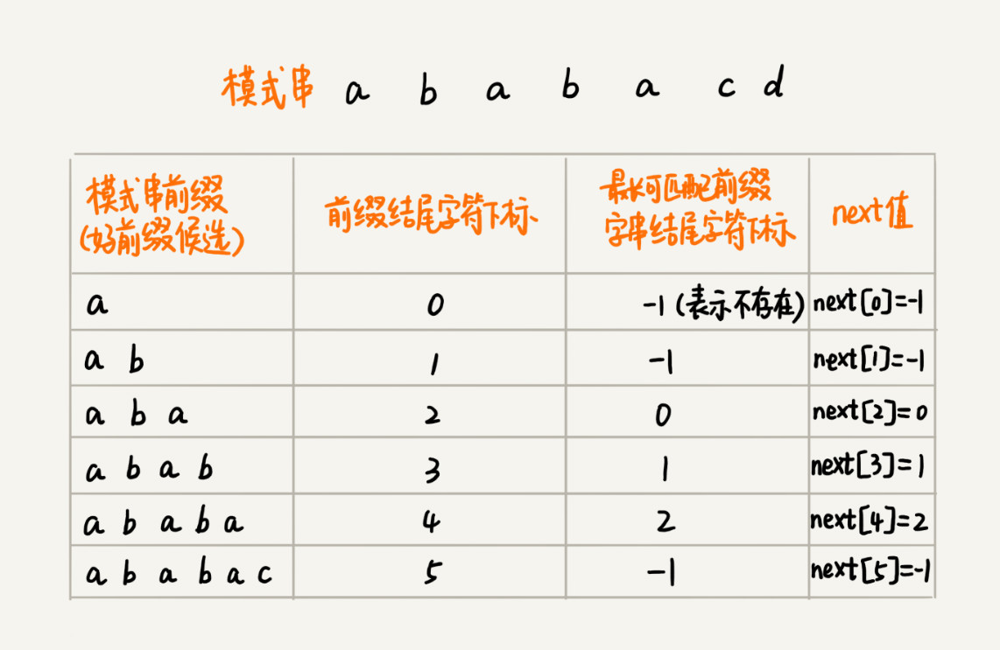

[TOC]

<!-- TOC -->autoauto- [BF 算法](#bf-算法)auto- [RK 算法](#rk-算法)auto- [BM 算法](#bm-算法)auto    - [BM 算法原理分析](#bm-算法原理分析)auto        - [1. 坏字符规则](#1-坏字符规则)auto        - [2. 好后缀规则](#2-好后缀规则)auto    - [BM 算法代码实现](#bm-算法代码实现)auto- [KMP 算法](#kmp-算法)auto    - [KMP 算法基本原理](#kmp-算法基本原理)auto    - [失效函数计算方法](#失效函数计算方法)auto- [BF 和 RK 的 Python 实现](#bf-和-rk-的-python-实现)auto- [BM 的 Python 实现](#bm-的-python-实现)auto- [KMP 的 Python 实现](#kmp-的-python-实现)autoauto<!-- /TOC -->

# BF 算法

BF 算法中的 BF 是 Brute Force 的缩写，中文叫作暴力匹配算法，也叫朴素匹配算法。

**我们在主串中，检查起始位置分别是 0、1、2…n-m 且长度为 m 的 n-m+1 个子串，看有没有跟模式串匹配的**。


BF 算法的时间复杂度很高，是 O(n*m)

---

# RK 算法

因为每次检查主串与子串是否匹配，需要依次比对每个字符，所以 BF 算法的时间复杂度就比较高，是 O(n*m)。我们对朴素的字符串匹配算法稍加改造，引入哈希算法，时间复杂度立刻就会降低。

RK 算法的思路是这样的：我们通过哈希算法对主串中的 n-m+1 个子串分别求哈希值，然后逐个与模式串的哈希值比较大小。如果某个子串的哈希值与模式串相等，那就说明对应的子串和模式串匹配了（这里先不考虑哈希冲突的问题，后面我们会讲到）。因为哈希值是一个数字，数字之间比较是否相等是非常快速的，所以模式串和子串比较的效率就提高了。


不过，通过哈希算法计算子串的哈希值的时候，我们需要遍历子串中的每个字符。尽管模式串与子串比较的效率提高了，但是，算法整体的效率并没有提高。有没有方法可以提高哈希算法计算子串哈希值的效率呢？

这就需要哈希算法设计的非常有技巧了。我们假设要匹配的字符串的字符集中只包含 K 个字符，我们可以用一个 K 进制数来表示一个子串，这个 K 进制数转化成十进制数，作为子串的哈希值。表述起来有点抽象，我举了一个例子，看完你应该就能懂了。

比如要处理的字符串只包含 a～z 这 26 个小写字母，那我们就用二十六进制来表示一个字符串。我们把 a～z 这 26 个字符映射到 0～25 这 26 个数字，a 就表示 0，b 就表示 1，以此类推，z 表示 25。

在十进制的表示法中，一个数字的值是通过下面的方式计算出来的。对应到二十六进制，一个包含 a 到 z 这 26 个字符的字符串，计算哈希的时候，我们只需要把进位从 10 改成 26 就可以。


---

# BM 算法

## BM 算法原理分析

BM 算法包含两部分，分别是**坏字符规则**（bad character rule）和**好后缀规则**（good suffix shift）。

### 1. 坏字符规则

前面讲的两个算法，在匹配的过程中，我们都是按模式串的下标从小到大的顺序，依次与主串中的字符进行匹配的。这种匹配顺序比较符合我们的思维习惯，而 BM 算法的匹配顺序比较特别，它是按照模式串下标从大到小的顺序，倒着匹配的。我画了一张图，你可以看下。


我们从模式串的末尾往前倒着匹配，当我们发现某个字符没法匹配的时候。我们把这个没有匹配的字符叫作**坏字符**（主串中的字符）。


我们拿坏字符 c 在模式串中查找，发现模式串中并不存在这个字符，也就是说，字符 c 与模式串中的任何字符都不可能匹配。这个时候，我们可以将模式串直接往后滑动三位，将模式串滑动到 c 后面的位置，再从模式串的末尾字符开始比较。


这个时候，我们发现，模式串中最后一个字符 d，还是无法跟主串中的 a 匹配，这个时候，还能将模式串往后滑动三位吗？答案是不行的。因为这个时候，坏字符 a 在模式串中是存在的，模式串中下标是 0 的位置也是字符 a。这种情况下，我们可以将模式串往后滑动两位，让两个 a 上下对齐，然后再从模式串的末尾字符开始，重新匹配。


第一次不匹配的时候，我们滑动了三位，第二次不匹配的时候，我们将模式串后移两位，那具体滑动多少位，到底有没有规律呢？

当发生不匹配的时候，我们把坏字符对应的模式串中的字符下标记作 si。如果坏字符在模式串中存在，我们把这个坏字符在模式串中的下标记作 xi。如果不存在，我们把 xi 记作 -1。那模式串往后移动的位数就等于 si-xi。（注意，我这里说的下标，都是字符在模式串的下标）。


这里我要特别说明一点，如果坏字符在模式串里多处出现，那我们在计算 xi 的时候，选择最靠后的那个，因为这样不会让模式串滑动过多，导致本来可能匹配的情况被滑动略过。

利用坏字符规则，BM 算法在最好情况下的时间复杂度非常低，是 O(n/m)。比如，主串是 aaabaaabaaabaaab，模式串是 aaaa。每次比对，模式串都可以直接后移四位，所以，匹配具有类似特点的模式串和主串的时候，BM 算法非常高效。

不过，单纯使用坏字符规则还是不够的。因为根据 si-xi 计算出来的移动位数，有可能是负数，比如主串是 aaaaaaaaaaaaaaaa，模式串是 baaa。不但不会向后滑动模式串，还有可能倒退。所以，BM 算法还需要用到“好后缀规则”。

### 2. 好后缀规则

好后缀规则实际上跟坏字符规则的思路很类似。你看我下面这幅图。当模式串滑动到图中的位置的时候，模式串和主串有 2 个字符是匹配的，倒数第 3 个字符发生了不匹配的情况。


我们把已经匹配的 bc 叫作好后缀，记作{u}。我们拿它在模式串中查找，如果找到了另一个跟{u}相匹配的子串{u*}，那我们就将模式串滑动到子串{u*}与主串中{u}对齐的位置。


如果在模式串中找不到另一个等于{u}的子串，我们就直接将模式串，滑动到主串中{u}的后面，因为之前的任何一次往后滑动，都没有匹配主串中{u}的情况。


不过，当模式串中不存在等于{u}的子串时，我们直接将模式串滑动到主串{u}的后面。这样做是否有点太过头呢？我们来看下面这个例子。这里面 bc 是好后缀，尽管在模式串中没有另外一个相匹配的子串{u*}，但是如果我们将模式串移动到好后缀的后面，如图所示，那就会错过模式串和主串可以匹配的情况。



如果好后缀在模式串中不存在可匹配的子串，那在我们一步一步往后滑动模式串的过程中，只要主串中的{u}与模式串有重合，那肯定就无法完全匹配。但是当模式串滑动到前缀与主串中{u}的后缀有部分重合的时候，并且重合的部分相等的时候，就有可能会存在完全匹配的情况。


所以，针对这种情况，我们不仅要看好后缀在模式串中，是否有另一个匹配的子串，我们还要考察好后缀的后缀子串，是否存在跟模式串的前缀子串匹配的。

所谓某个字符串 s 的后缀子串，就是最后一个字符跟 s 对齐的子串，比如 abc 的后缀子串就包括 c, bc。所谓前缀子串，就是起始字符跟 s 对齐的子串，比如 abc 的前缀子串有 a，ab。我们从好后缀的后缀子串中，找一个最长的并且能跟模式串的前缀子串匹配的，假设是{v}，然后将模式串滑动到如图所示的位置。


坏字符和好后缀的基本原理都讲完了，我现在回答一下前面那个问题。当模式串和主串中的某个字符不匹配的时候，如何选择用好后缀规则还是坏字符规则，来计算模式串往后滑动的位数？

我们可以分别计算好后缀和坏字符往后滑动的位数，然后取两个数中最大的，作为模式串往后滑动的位数。这种处理方法还可以避免我们前面提到的，根据坏字符规则，计算得到的往后滑动的位数，有可能是负数的情况。

---

# KMP 算法

## KMP 算法基本原理


KMP 算法就是在试图寻找一种规律：在模式串和主串匹配的过程中，当遇到坏字符后，对于已经比对过的好前缀，能否找到一种规律，将模式串一次性滑动很多位？

我们只需要拿好前缀本身，在它的后缀子串中，查找最长的那个可以跟好前缀的前缀子串匹配的。假设最长的可匹配的那部分前缀子串是{v}，长度是 k。我们把模式串一次性往后滑动 j-k 位，相当于，每次遇到坏字符的时候，我们就把 j 更新为 k，i 不变，然后继续比较。


为了表述起来方便，我把好前缀的所有后缀子串中，最长的可匹配前缀子串的那个后缀子串，叫作**最长可匹配后缀子串**；对应的前缀子串，叫作**最长可匹配前缀子串**。


如何来求好前缀的最长可匹配前缀和后缀子串呢？我发现，这个问题其实不涉及主串，只需要通过模式串本身就能求解。所以，我就在想，能不能事先预处理计算好，在模式串和主串匹配的过程中，直接拿过来就用呢？

类似 BM 算法中的 bc、suffix、prefix 数组，KMP 算法也可以提前构建一个数组，用来存储模式串中每个前缀（这些前缀都有可能是好前缀）的最长可匹配前缀子串的结尾字符下标。我们把这个数组定义为**next 数组**，很多书中还给这个数组起了一个名字，叫**失效函数**（failure function）。

数组的下标是每个前缀结尾字符下标，数组的值是这个前缀的最长可以匹配前缀子串的结尾字符下标。这句话有点拗口，我举了一个例子，你一看应该就懂了。



## 失效函数计算方法

当然，我们可以用非常笨的方法，比如要计算下面这个模式串 b 的 next[4]，我们就把 b[0, 4] 的所有后缀子串，从长到短找出来，依次看看，是否能跟模式串的前缀子串匹配。很显然，这个方法也可以计算得到 next 数组，但是效率非常低。有没有更加高效的方法呢？


这里的处理非常有技巧，类似于动态规划。

我们按照下标从小到大，依次计算 next 数组的值。当我们要计算 next[i] 的时候，前面的 next[0]，next[1]，……，next[i-1] 应该已经计算出来了。利用已经计算出来的 next 值，我们是否可以快速推导出 next[i] 的值呢？

如果 next[i-1]=k-1，也就是说，子串 b[0, k-1] 是 b[0, i-1] 的最长可匹配前缀子串。如果子串 b[0, k-1] 的下一个字符 b[k]，与 b[0, i-1] 的下一个字符 b[i] 匹配，那子串 b[0, k] 就是 b[0, i] 的最长可匹配前缀子串。所以，next[i] 等于 k。但是，如果 b[0, k-1] 的下一字符 b[k] 跟 b[0, i-1] 的下一个字符 b[i] 不相等呢？这个时候就不能简单地通过 next[i-1] 得到 next[i] 了。这个时候该怎么办呢？


我们假设 b[0, i] 的最长可匹配后缀子串是 b[r, i]。如果我们把最后一个字符去掉，那 b[r, i-1] 肯定是 b[0, i-1] 的可匹配后缀子串，但不一定是最长可匹配后缀子串。所以，既然 b[0, i-1] 最长可匹配后缀子串对应的模式串的前缀子串的下一个字符并不等于 b[i]，那么我们就可以考察 b[0, i-1] 的次长可匹配后缀子串 b[x, i-1] 对应的可匹配前缀子串 b[0, i-1-x] 的下一个字符 b[i-x] 是否等于 b[i]。如果等于，那 b[x, i] 就是 b[0, i] 的最长可匹配后缀子串。


可是，如何求得 b[0, i-1] 的次长可匹配后缀子串呢？次长可匹配后缀子串肯定被包含在最长可匹配后缀子串中，而最长可匹配后缀子串又对应最长可匹配前缀子串 b[0, y]。于是，查找 b[0, i-1] 的次长可匹配后缀子串，这个问题就变成，查找 b[0, y] 的最长匹配后缀子串的问题了。


按照这个思路，我们可以考察完所有的 b[0, i-1] 的可匹配后缀子串 b[y, i-1]，直到找到一个可匹配的后缀子串，它对应的前缀子串的下一个字符等于 b[i]，那这个 b[y, i] 就是 b[0, i] 的最长可匹配后缀子串。

---

# BF 和 RK 的 Python 实现

```python
from time import time


def bf(main, pattern):
    """
    字符串匹配，bf暴搜
    :param main: 主串
    :param pattern: 模式串
    :return:
    """
    n = len(main)
    m = len(pattern)

    if n <= m:
        return 0 if pattern == main else -1

    for i in range(n-m+1):
        for j in range(m):
            if main[i+j] == pattern[j]:
                if j == m-1:
                    return i
                else:
                    continue
            else:
                break
    return -1


def simple_hash(s, start, end):
    """
    计算子串的哈希值
    每个字符取acs-ii码后求和
    :param s:
    :param start:
    :param end:
    :return:
    """
    assert start <= end

    ret = 0
    for c in s[start: end+1]:
        ret += ord(c)
    return ret


def rk(main, pattern):
    n = len(main)
    m = len(pattern)

    if n <= m:
        return 0 if pattern == main else -1

    # 子串哈希值表
    hash_memo = [None] * (n-m+1)
    hash_memo[0] = simple_hash(main, 0, m-1)
    for i in range(1, n-m+1):
        hash_memo[i] = hash_memo[i-1] - simple_hash(main, i-1, i-1) + simple_hash(main, i+m-1, i+m-1)

    # 模式串哈希值
    hash_p = simple_hash(pattern, 0, m-1)

    for i, h in enumerate(hash_memo):
        # 可能存在哈希冲突
        if h == hash_p:
            if pattern == main[i:i+m]:
                return i
            else:
                continue
    return -1


if __name__ == '__main__':
    m_str = 'a'*10000
    p_str = 'a'*200+'b'

    print('--- time consume ---')
    t = time()
    print('[bf] result:', bf(m_str, p_str))
    print('[bf] time cost: {0:.5}s'.format(time()-t))

    t = time()
    print('[rk] result:', rk(m_str, p_str))
    print('[rk] time cost: {0:.5}s'.format(time()-t))

    print('')
    print('--- search ---')
    m_str = 'thequickbrownfoxjumpsoverthelazydog'
    p_str = 'jump'
    print('[bf] result:', bf(m_str, p_str))
    print('[rk] result:', rk(m_str, p_str))
```

# BM 的 Python 实现

```python
SIZE = 256


def bm(main, pattern):
    """
    BM算法
    匹配规则：
    1. 坏字符规则
    2. 好字符规则
    :param main:
    :param pattern:
    :return:
    """
    assert type(main) is str and type(pattern) is str
    n, m = len(main), len(pattern)

    if n <= m:
        return 0 if main == pattern else -1

    # bc
    bc = [-1] * SIZE
    generate_bc(pattern, m, bc)

    # gs
    suffix = [-1] * m
    prefix = [False] * m
    generate_gs(pattern, m, suffix, prefix)

    i = 0
    while i < n-m+1:
        j = m - 1
        while j >= 0:
            if main[i+j] != pattern[j]:
                break
            else:
                j -= 1

        # pattern整个已被匹配，返回
        if j == -1:
            return i

        # 1. bc规则计算后移位数
        x = j - bc[ord(main[i+j])]

        # 2. gs规则计算后移位数
        y = 0
        if j != m - 1:    # 存在gs
            y = move_by_gs(j, m, suffix, prefix)

        i += max(x, y)

    return -1


def generate_bc(pattern, m, bc):
    """
    生成坏字符哈希表
    :param pattern:
    :param m:
    :param bc:
    :return:
    """
    for i in range(m):
        bc[ord(pattern[i])] = i


def generate_gs(pattern, m, suffix, prefix):
    """
    好后缀预处理
    :param pattern:
    :param m:
    :param suffix:
    :param prefix:
    :return:
    """
    for i in range(m-1):
        k = 0   # pattern[:i+1]和pattern的公共后缀长度
        for j in range(i, -1, -1):
            if pattern[j] == pattern[m-1-k]:
                k += 1
                suffix[k] = j
                if j == 0:
                    prefix[k] = True
            else:
                break


def move_by_gs(j, m, suffix, prefix):
    """
    通过好后缀计算移动值
    需要处理三种情况：
    1. 整个好后缀在pattern仍能找到
    2. 好后缀里存在 *后缀子串* 能和pattern的 *前缀* 匹配
    3. 其他
    :param j:
    :param m:
    :param suffix:
    :param prefix:
    :return:
    """
    k = m - 1 - j           # j指向从后往前的第一个坏字符，k是此次匹配的好后缀的长度

    if suffix[k] != -1:             # 1. 整个好后缀在pattern剩余字符中仍有出现
        return j - suffix[k] + 1
    else:
        for r in range(j+2, m):     # 2. 后缀子串从长到短搜索
            if prefix[m-r]:
                return r
        return m                    # 3. 其他情况


if __name__ == '__main__':
    print('--- search ---')
    m_str = 'dfasdeeeetewtweyyyhtruuueyytewtweyyhtrhrth'
    p_str = 'eyytewtweyy'
    print('[Built-in Functions] result:', m_str.find(p_str))
    print('[bm] result:', bm(m_str, p_str))
```

# KMP 的 Python 实现

```python
def kmp(main, pattern):
    """
    kmp字符串匹配
    :param main:
    :param pattern:
    :return:
    """
    assert type(main) is str and type(pattern) is str

    n, m = len(main), len(pattern)

    if m == 0:
        return 0
    if n <= m:
        return 0 if main == pattern else -1

    # 求解next数组
    next = get_next(pattern)

    j = 0
    for i in range(n):
        # 在pattern[:j]中，从长到短递归去找最长的和后缀子串匹配的前缀子串
        while j > 0 and main[i] != pattern[j]:
            j = next[j-1] + 1   # 如果next[j-1] = -1，则要从起始字符取匹配

        if main[i] == pattern[j]:
            if j == m-1:
                return i-m+1
            else:
                j += 1
    return -1


def get_next(pattern):
    """
    next数组生成
    注意：
    理解的难点在于next[i]根据next[0], next[1]…… next[i-1]的求解
    next[i]的值依赖于前面的next数组的值，求解思路：
    1. 首先取出前一个最长的匹配的前缀子串，其下标就是next[i-1]
    2. 对比下一个字符，如果匹配，直接赋值next[i]为next[i-1]+1，因为i-1的时候已经是最长
    *3. 如果不匹配，需要递归去找次长的匹配的前缀子串，这里难理解的就是递归地方式，next[i-1]
        是i-1的最长匹配前缀子串的下标结尾，则 *next[next[i-1]]* 是其次长匹配前缀子串的下标
        结尾
    *4. 递归的出口，就是在次长前缀子串的下一个字符和当前匹配 或 遇到-1，遇到-1则说明没找到任
        何匹配的前缀子串，这时需要找pattern的第一个字符对比
    ps: next[m-1]的数值其实没有任何意义，求解时可以不理。网上也有将next数组往右平移的做法。
    :param pattern:
    :return:
    """
    m = len(pattern)
    next = [-1] * m

    next[0] = -1

    # for i in range(1, m):
    for i in range(1, m-1):
        j = next[i-1]       # 取i-1时匹配到的最长前缀子串
        while j != -1 and pattern[j+1] != pattern[i]:
            j = next[j]     # 次长的前缀子串的下标，即是next[next[i-1]]

        # 根据上面跳出while的条件，当j=-1时，需要比较pattern[0]和当前字符
        # 如果j!=-1，则pattern[j+1]和pattern[i]一定是相等的
        if pattern[j+1] == pattern[i]:  # 如果接下来的字符也是匹配的，那i的最长前缀子串下标是next[i-1]+1
            j += 1
        next[i] = j

    return next


if __name__ == '__main__':
    m_str = "aabbbbaaabbababbabbbabaaabb"
    p_str = "abbabbbabaa"

    print('--- search ---')
    print('[Built-in Functions] result:', m_str.find(p_str))
    print('[kmp] result:', kmp(m_str, p_str))
```

