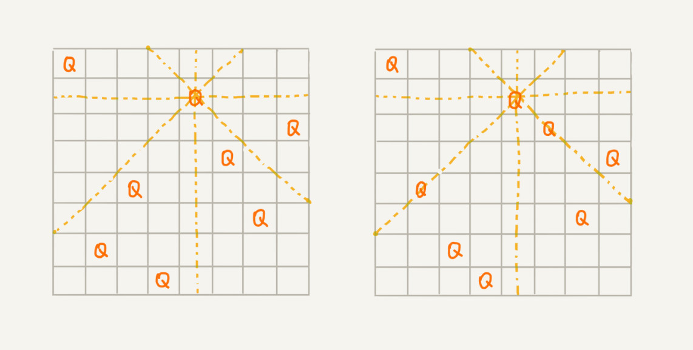

# 八皇后问题

我们有一个 8x8 的棋盘，希望往里放 8 个棋子（皇后），每个棋子所在的行、列、对角线都不能有另一个棋子。



```java
int[] result = new int[8];// 全局或成员变量, 下标表示行, 值表示 queen 存储在哪一列
public void cal8queens(int row) { // 调用方式：cal8queens(0);
  if (row == 8) { // 8 个棋子都放置好了，打印结果
    printQueens(result);
    return; // 8 行棋子都放好了，已经没法再往下递归了，所以就 return
  }
  for (int column = 0; column < 8; ++column) { // 每一行都有 8 中放法
    if (isOk(row, column)) { // 有些放法不满足要求
      result[row] = column; // 第 row 行的棋子放到了 column 列
      cal8queens(row+1); // 考察下一行
    }
  }
}

private boolean isOk(int row, int column) {// 判断 row 行 column 列放置是否合适
  int leftup = column - 1, rightup = column + 1;
  for (int i = row-1; i >= 0; --i) { // 逐行往上考察每一行
    if (result[i] == column) return false; // 第 i 行的 column 列有棋子吗？
    if (leftup >= 0) { // 考察左上对角线：第 i 行 leftup 列有棋子吗？
      if (result[i] == leftup) return false;
    }
    if (rightup < 8) { // 考察右上对角线：第 i 行 rightup 列有棋子吗？
      if (result[i] == rightup) return false;
    }
    --leftup; ++rightup;
  }
  return true;
}

private void printQueens(int[] result) { // 打印出一个二维矩阵
  for (int row = 0; row < 8; ++row) {
    for (int column = 0; column < 8; ++column) {
      if (result[row] == column) System.out.print("Q ");
      else System.out.print("* ");
    }
    System.out.println();
  }
  System.out.println();
}

```

# 0-1 背包

这个问题的经典解法是**动态规划**，不过还有一种简单但没有那么高效的解法。

我们有一个背包，背包总的承载重量是 Wkg。现在我们有 n 个物品，每个物品的重量不等，并且不可分割。我们现在期望选择几件物品，装载到背包中。在不超过背包所能装载重量的前提下，如何让背包中物品的总重量最大？

```java
public int maxW = Integer.MIN_VALUE; // 存储背包中物品总重量的最大值
// cw 表示当前已经装进去的物品的重量和；i 表示考察到哪个物品了；
// w 背包重量；items 表示每个物品的重量；n 表示物品个数
// 假设背包可承受重量 100，物品个数 10，物品重量存储在数组 a 中，那可以这样调用函数：
// f(0, 0, a, 10, 100)
public void f(int i, int cw, int[] items, int n, int w) {
  if (cw == w || i == n) { // cw==w 表示装满了 ;i==n 表示已经考察完所有的物品
    if (cw > maxW) maxW = cw;
    return;
  }
  f(i+1, cw, items, n, w);
  if (cw + items[i] <= w) {// 已经超过可以背包承受的重量的时候，就不要再装了
    f(i+1,cw + items[i], items, n, w);
  }
}

```

# 正则表达式

```java
public class Pattern {
  private boolean matched = false;
  private char[] pattern; // 正则表达式
  private int plen; // 正则表达式长度

  public Pattern(char[] pattern, int plen) {
    this.pattern = pattern;
    this.plen = plen;
  }

  public boolean match(char[] text, int tlen) { // 文本串及长度
    matched = false;
    rmatch(0, 0, text, tlen);
    return matched;
  }

  private void rmatch(int ti, int pj, char[] text, int tlen) {
    if (matched) return; // 如果已经匹配了，就不要继续递归了
    if (pj == plen) { // 正则表达式到结尾了
      if (ti == tlen) matched = true; // 文本串也到结尾了
      return;
    }
    if (pattern[pj] == '*') { // * 匹配任意个字符
      for (int k = 0; k <= tlen-ti; ++k) {
        rmatch(ti+k, pj+1, text, tlen);
      }
    } else if (pattern[pj] == '?') { // ? 匹配 0 个或者 1 个字符
      rmatch(ti, pj+1, text, tlen);
      rmatch(ti+1, pj+1, text, tlen);
    } else if (ti < tlen && pattern[pj] == text[ti]) { // 纯字符匹配才行
      rmatch(ti+1, pj+1, text, tlen);
    }
  }
}

```

