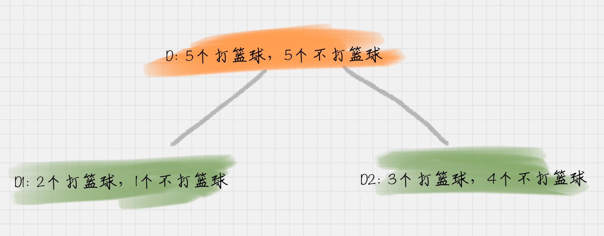

# 决策树工作原理

## 构造

构造的过程就是选择什么属性作为节点的过程

1. 根节点：就是树的最顶端，最开始的那个节点。
2. 内部结点：就是树中间的那些节点。
3. 叶节点：就是树最底部的节点，也就是决策结果。

## 剪枝

剪枝是为了防止“过拟合”（Overfitting）现象的发生。

### 预剪枝（Pre-Pruning）

预剪枝实在决策树构造时就进行剪枝。方法是在构造的过程中对节点进行评估，如果对某个节点进行划分，在验证集中不能带来准确性的提升，那么对这个节点进行划分就没有意义，这时就会把当前节点作为叶子节点，不能进行划分。

### 后剪枝（Post-Pruning）

后剪枝就是在生成决策树之后再进行剪枝，通常会从决策树的叶节点开始，逐层向上对每个节点进行评估。如果剪掉这个节点子树，与保留该节点子树在分类准确性上差别不大，或者剪掉该节点子树，能在验证集中带来准确性的提升，那么就可以把该节点子树进行剪枝。方法是：用这个节点子树的叶子节点来替代该节点，类标记为这个节点子树中最频繁的那个类。

# 信息熵（entropy）

信息熵**表示了信息的不确定度**

举个简单的例子，假设有两个集合

- 集合 1：5 次去打篮球，1 次不去打篮球
- 集合 2：3 次去打篮球，3 次不去打篮球

可以计算得出：

从上面计算结果可以看出，信息熵越大，纯度越低。

经典的"不纯度"的指标有三种，分别是**信息增益（ID3 算法）、信息增益率（C4.5 算法）、以及基尼系数（Cart 算法）**。

## ID3 算法

信息增益的公式可以 表示为：

比如针对图上这个例子，D 作为节点的信息增益为：

**ID3 就是要将信息增益最大的节点作为父节点，这样可以得到纯度高的决策树。**

## C4.5 算法

改进：

1. 采用信息增益率
2. 采用悲观剪枝
3. 离散化处理连续数据
4. 处理缺失值

## CART 算法

GINI 系数的计算公式为：

