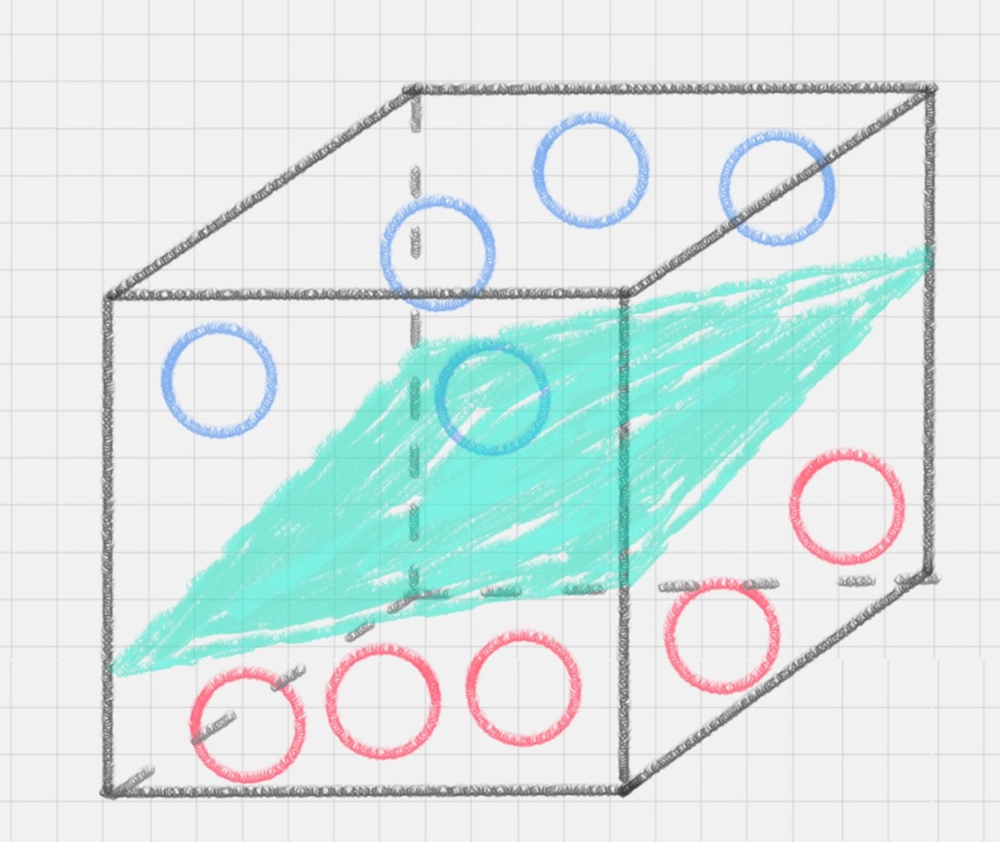

# SVM工作原理

用 SVM 计算的过程就是帮我们找到那个超平面的过程，这个超平面就是我们的 SVM 分类器。

怎样才能寻找到直线 C 这个更优的答案呢？这里，我们引入一个 SVM 特有的概念：分类间隔。

##  点到超平面的距离公式

**SVM 就是帮我们找到一个超平面**，这个超平面能将不同的样本划分开，同时使得样本集中的点到这个分类超平面的最小距离（即分类间隔）最大化。

在这个过程中，**支持向量**就是离**分类超平面**最近的样本点，实际上如果确定了支持向量也就确定了这个超平面。所以支持向量决定了分类间隔到底是多少，而在最大间隔以外的样本点，其实对分类都没有意义。

所以说， SVM 就是求解最大分类间隔的过程，我们还需要对分类间隔的大小进行定义。

首先，我们定义某类样本集到超平面的距离是这个样本集合内的样本到超平面的最短距离。我们用 di 代表点 xi 到超平面 wxi+b=0 的欧氏距离。因此我们要求 di 的最小值，用它来代表这个样本到超平面的最短距离。di 可以用公式计算得出：

其中 ||w|| 为超平面的范数，di 的公式可以用解析几何知识进行推导，这里不做解释。

## 最大间隔的优化模型

我们的目标就是找出所有分类间隔中最大的那个值对应的超平面。在数学上，这是一个凸优化问题（凸优化就是关于求凸集中的凸函数最小化的问题，这里不具体展开）。通过凸优化问题，最后可以求出最优的 w 和 b，也就是我们想要找的最优超平面。中间求解的过程会用到拉格朗日乘子，和 KKT（Karush-Kuhn-Tucker）条件。数学公式比较多，这里不进行展开。

# 硬间隔、软间隔和非线性 SVM

假如数据是完全的线性可分的，那么学习到的模型可以称为硬间隔支持向量机。**换个说法，硬间隔指的就是完全分类准确，不能存在分类错误的情况。软间隔，就是允许一定量的样本分类错误。**

另外还存在一种情况，就是非线性支持向量机。**核函数，它可以将样本从原始空间映射到一个更高维的特质空间中，使得样本在新的空间中线性可分。**

所以在非线性 SVM 中，核函数的选择就是影响 SVM 最大的变量。最常用的核函数有线性核、多项式核、高斯核、拉普拉斯核、sigmoid 核，或者是这些核函数的组合。这些函数的区别在于映射方式的不同。通过这些核函数，我们就可以把样本空间投射到新的高维空间中。

# 用 SVM 如何解决多分类问题

1. 一对多法

假设我们要把物体分成 A、B、C、D 四种分类，那么我们可以先把其中的一类作为分类 1，其他类统一归为分类 2。这样我们可以构造 4 种 SVM，分别为以下的情况：

 （1）样本 A 作为正集，B，C，D 作为负集；

 （2）样本 B 作为正集，A，C，D 作为负集；

 （3）样本 C 作为正集，A，B，D 作为负集；

 （4）样本 D 作为正集，A，B，C 作为负集。

这种方法，针对 K 个分类，需要训练 K 个分类器，**分类速度较快，但训练速度较慢**，因为每个分类器都需要对全部样本进行训练，而且**负样本数量远大于正样本数量，会造成样本不对称的情况**，而且**当增加新的分类，比如第 K+1 类时，需要重新对分类器进行构造**。

2. 一对一法

一对一法的初衷是想在**训练的时候更加灵活**。我们可以在任意两类样本之间构造一个 SVM，这样针对 K 类的样本，就会有 C(k,2) 类分类器。

比如我们想要划分 A、B、C 三个类，可以构造 3 个分类器：

 （1）分类器 1：A、B；

 （2）分类器 2：A、C；

 （3）分类器 3：B、C。

当对一个未知样本进行分类时，每一个分类器都会有一个分类结果，即为 1 票，最终得票最多的类别就是整个未知样本的类别。 

这样做的好处是，如果新增一类，不需要重新训练所有的 SVM，只需要训练和新增这一类样本的分类器。而且这种方式在训练单个 SVM 模型的时候，训练速度快。 

但这种方法的不足在于，**分类器的个数与 K 的平方成正比**，所以当 K 较大时，训练和测试的时间会比较慢。