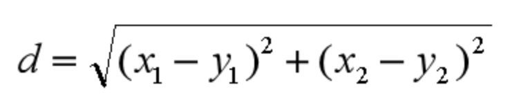
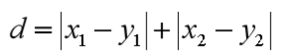

# KNN 的工作原理

1. 计算待分类物体与其他物体之间的距离；
2. 统计距离最近的 K 个邻居；
3. 对于 K 个最近的邻居，她们属于哪个分类最多，待分类物体就属于哪一类。

## K 值如何选择

如果 K 值比较小，就相当于未分类物体与它的邻居非常接近才行。这样产生的一个问题就是，如果邻居点是个噪声点，那么未分类物体的分类也会产生误差，这样 KNN 分类就会产生过拟合。

如果 K 值比较大，相当于距离过远的点也会对未知物体的分类产生影响，虽然这种情况的好处是鲁棒性强，但是不足也很明显，会产生欠拟合情况，也就是没有把未分类物体真正分类出来。

所以 K 值应该是个实践出来的结果，并不是我们事先而定的。在工程上，我们一般采用**交叉验证**的方式选取 K 值。

交叉验证的思路就是，把样本集中的大部分样本作为训练集，剩余的小部分样本用于预测，来验证分类模型的准确性。所以在 KNN 算法中，我们一般会把 K 值选取在较小的范围内，同时在验证集上准确率最高的那一个最终确定作为 K 值。

## 距离如何计算

1. 欧氏距离；
2. 曼哈顿距离；
3. 闵可夫斯基距离；
4. 切比雪夫距离； 
5. 余弦距离。

**欧氏距离**是我们最常用的距离公式，也叫做欧几里得距离。在二维空间中，两点的欧式距离就是：

**曼哈顿距离**在几何空间中用的比较多。以下图为例，绿色的直线代表两点之间的欧式距离，而红色和黄色的线为两点的曼哈顿距离。所以曼哈顿距离等于两个点在坐标系上绝对轴距总和。用公式表示就是：

**闵可夫斯基距离**不是一个距离，而是一组距离的定义。对于 n 维空间中的两个点 x(x1,x2,…,xn) 和 y(y1,y2,…,yn) ， x 和 y 两点之间的闵可夫斯基距离为：

其中 p 代表空间的维数，当 p=1 时，就是曼哈顿距离；当 p=2 时，就是欧氏距离；当 p→∞时，就是切比雪夫距离。

那么**切比雪夫距离**怎么计算呢？二个点之间的切比雪夫距离就是这两个点坐标数值差的绝对值的最大值，用数学表示就是：max(|x1-y1|,|x2-y2|)。

**余弦距离**实际上计算的是两个向量的夹角，是在方向上计算两者之间的差异，对绝对数值不敏感。在兴趣相关性比较上，角度关系比距离的绝对值更重要，因此余弦距离可以用于衡量用户对内容兴趣的区分度。比如我们用搜索引擎搜索某个关键词，它还会给你推荐其他的相关搜索，这些推荐的关键词就是采用余弦距离计算得出的。

# KD 树

减少计算距离次数，提升 KNN 的搜索效率。

# 用 KNN 做回归

对于一个新点，我们需要找出这个点的 K 个最近邻居，然后将这些邻居的属性的平均值赋给该点，就可以得到该点的属性。当然不同邻居的影响力权重可以设置成不同的。举个例子，比如一部电影 A，已知它是动作片，当 K=3 时，最近的 3 部电影是《战狼》，《红海行动》和《碟中谍 6》，那么它的打斗次数和接吻次数的预估值分别为 (100+95+105)/3=100 次、(5+3+31)/3=13 次。