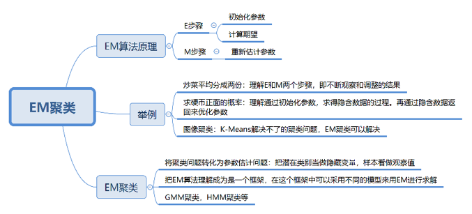

## EM 算法的工作原理

说到 EM 算法，我们先来看一个概念“**最大似然**”，英文是 Maximum Likelihood，Likelihood 代表可能性，所以最大似然也就是最大可能性的意思。

**最大似然估计**是什么呢？它指的就是一件事情已经发生了，然后反推更有可能是什么因素造成的。还是用一男一女比较身高为例，假设有一个人比另一个人高，反推他可能是男性。最大似然估计是一种通过已知结果，估计参数的方法。

因为 K-Means 是通过距离来区分样本之间的差别的，且每个样本在计算的时候只能属于一个分类，称之为是**硬聚类算法**。而 EM 聚类在求解的过程中，实际上每个样本都有一定的概率和每个聚类相关，叫做**软聚类算法**。

在 EM 这个框架中，E 步骤相当于是通过初始化的参数来估计隐含变量。M 步骤就是通过隐含变量反推来优化参数。最后通过 EM 步骤的迭代得到模型参数。

