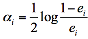

在数据挖掘中，分类算法可以说是核心算法，其中 AdaBoost 算法与随机森林算法一样都属于分类算法中的**集成算法**。

集成的含义就是集思广益，博取众长，当我们做决定的时候，我们先听取多个专家的意见，再做决定。集成算法通常有两种方式，分别是投票选举（bagging）和再学习（boosting）。投票选举的场景类似把专家召集到一个会议桌前，当做一个决定的时候，让 K 个专家（K 个模型）分别进行分类，然后选择出现次数最多的那个类作为最终的分类结果。再学习相当于把 K 个专家（K 个分类器）进行加权融合，形成一个新的超级专家（强分类器），让这个超级专家做判断。

所以你能看出来，投票选举和再学习还是有区别的。Boosting 的含义是提升，它的作用是每一次训练的时候都对上一次的训练进行改进提升，在训练的过程中这 K 个“专家”之间是有依赖性的，当引入第 K 个“专家”（第 K 个分类器）的时候，实际上是对前 K-1 个专家的优化。而 bagging 在做投票选举的时候可以并行计算，也就是 K 个“专家”在做判断的时候是相互独立的，不存在依赖性。

## AdaBoost 的工作原理

AdaBoost 的英文全称是 Adaptive Boosting，中文含义是自适应提升算法。

假设弱分类器为 $G_i(x)$，它在强分类器中的权重 $\alpha_i$，那么就可以得出强分类器 $f(x)​$：

有了这个公式，为了求解强分类器，你会关注两个问题：

1. 如何得到弱分类器，也就是在每次迭代训练的过程中，如何得到最优弱分类器？
2. 每个弱分类器在强分类器中的权重是如何计算的？

我们先来看下第二个问题。实际上在一个由 K 个弱分类器中组成的强分类器中，如果弱分类器的分类效果好，那么权重应该比较大，如果弱分类器的分类效果一般，权重应该降低。所以我们需要基于这个弱分类器对样本的分类错误率来决定它的权重，用公式表示就是：

其中 $e_i$ 代表第 i 个分类器的分类错误率。

然后我们再来看下第一个问题，如何在每次训练迭代的过程中选择最优的弱分类器？

实际上，AdaBoost 算法是通过改变样本的数据分布来实现的。AdaBoost 会判断每次训练的样本是否正确分类，对于正确分类的样本，降低它的权重，对于被错误分类的样本，增加它的权重。再基于上一次得到的分类准确率，来确定这次训练样本中每个样本的权重。然后将修改过权重的新数据集传递给下一层的分类器进行训练。这样做的好处就是，通过每一轮训练样本的动态权重，可以让训练的焦点集中到难分类的样本上，最终得到的弱分类器的组合更容易得到更高的分类准确率。

我们可以用 $D_{k+1} $ 代表第 k+1 轮训练中，样本的权重集合，其中 $w_{k+1,k}$ 代表第 k+1 轮中第一个样本的权重，以此类推 $w_{k+1,N}$ 代表第 k+1 轮中第 N 个样本的权重，因此用公式表示为：

第 k+1 轮中的样本权重，是根据该样本在第 k 轮的权重以及第 k 个分类器的准确率而定，具体的公式为：

