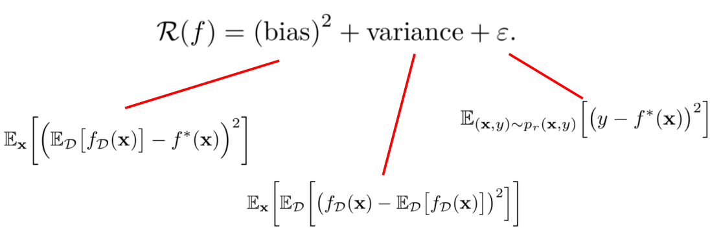
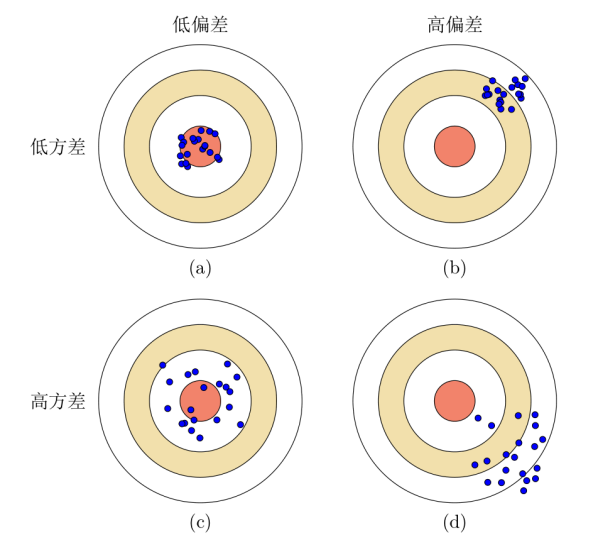
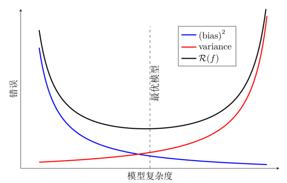

# 偏差和方差

**偏差**与**方差**分别是用于衡量一个模型**泛化误差**的两个方面：

- 模型的**偏差**，指的是模型预测的**期望值**与**真实值**之间的差；
- 模型的**方差**，指的是模型预测的**期望值**与**预测值**之间的差平方和；

在**监督学习**中，模型的**泛化误差**可**分解**为偏差、方差与噪声之和。

**偏差**用于描述模型的**拟合能力**；
**方差**用于描述模型的**稳定性**。

- 一般来说，当一个模型在训练集上的错误率比较高时，说明模型的拟合能力不够，偏差比较高。这种情况可以增加数据特征、提高模型复杂度，减少正则化系数等操作来改进模型。
- 当模型在训练集上的错误率比较低，但验证集上的错误率比较高时，说明模型过拟合，方差比较高。这种情况可以通过降低模型复杂度，加大正则化系数，引入先验等方法来缓解。
- 此外，还有一种有效的降低方差的方法为**集成模型**，即通过多个高方差模型的平均来降低方差。 

# 评价指标

对于类别c来说，模型在测试集上的结果可以分为以下四种情况：
1. 真正例（True Positive， TP）：一个样本的真实类别为c并且模型正确地预测为类别c。这类样本数量记为 TP

2. 假负例（False Negative， FN）：一个样本的真实类别为c，模型错误地预测为其它类。这类样本数量记为 FN

3. 假正例（False Positive， FP）一个样本的真实类别为其它类，模型错误地预测为类c。这类样本数量记为 FP

4. 真负例（True Negative， TN）：一个样本的真实类别为其它类，模型也预测为其它类。这类样本数量记为TN。对于类别c来说，这种情况一般不需要关注。 

**查准率**（Precision），也叫精确率或精度，类别c的查准率为是所有预测为类别c的样本中，预测正确的比例。 
$$
P=\frac{TP}{TP+FP}**查全率**（Recall），也叫召回率，类别c的查全率为是所有真实标签为类别c的样本中，预测正确的比例。
$$

**查全率**（Recall），也叫召回率，类别c的查全率为是所有真实标签为类别c的样本中，预测正确的比例。 
$$
R=\frac{TP}{TP+FN}
$$
**交叉验证** 交叉验证（Cross Validation）是一种比较好的可能衡量机器学习模型的统计分析方法，可以有效避免划分训练集和测试集时的随机性对评价结果造成的影响。我们可以把原始数据集平均分为K 组不重复的子集，每次选K - 1组子集作为训练集，剩下的一组子集作为验证集。这样可以进行K 次试验并得到K 个模型。这K 个模型在各自验证集上的错误率的平均作为分类器的评价。 